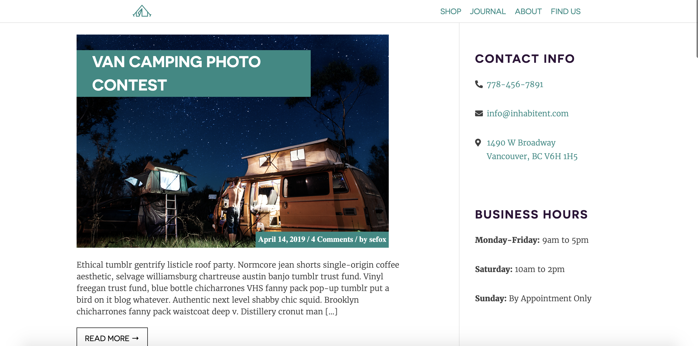
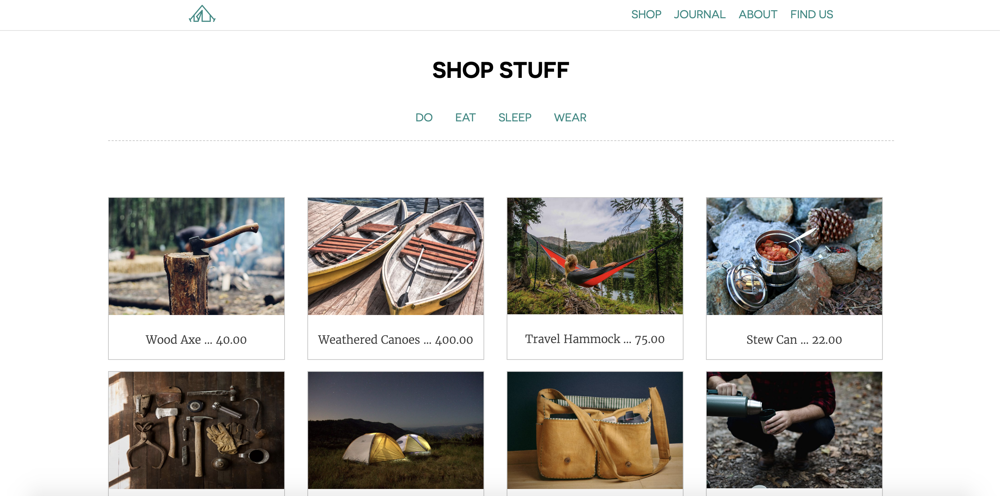

# Inhabitent Wordpress Theme
 
Wordpress theme for retail company specializing in outdoors goods. Features blog and adventures section, for special posts.
 
The Inhabintent Wordpress Theme used Wordpress as a CMS, and also used PHP, CSS and HTML.
 
## Screenshots

 

 

 
## Custom Widget
Allows customers to access the hours and contact information easily, and site administrators to update it if necessary.
 

 
### Notes on Project
This was a huge project! If I had a graph to show how I worked on this website it would show me being extremely careful and organized at the beginning, and utterly chaotic at the end. Still, I'm happy with how it turned out -- even though it took me a long time to understand body class, and why it's so awesome!
 
This project really gave me a lot of different changes to work with PHP, and I really enjoyed creating the entire front page drawing from PHP generated links and information.
